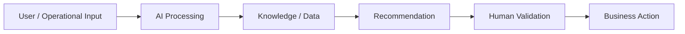

# Manufacturing RAG Copilot

## Business problem

Help engineers find relevant troubleshooting and quality guidance across distributed knowledge.

## AI solution

Retrieve relevant evidence first, then generate a grounded answer with source references.

## Architecture

## Technology

`Python · scikit-learn · TF-IDF · RAG`

## Business value

Potential outcomes include reduced manual effort, faster response, better knowledge reuse and more consistent processes.

## Screenshots

Add 2–3 real screenshots to the `screenshots/` folder after running the project.

## Governance

AI output is decision support. Qualified personnel must validate engineering, quality, safety, production or customer-impacting decisions.

## Production evolution

Connect the prototype to approved enterprise AI services, enterprise knowledge sources, identity/access controls, evaluation, monitoring and workflow systems.
