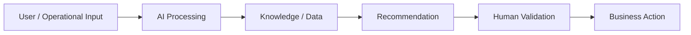

# Low-Code Manufacturing AI Agent

## Business problem

Reduce repetitive manual steps in manufacturing issue triage.

## AI solution

Classify issues, identify cause categories, recommend checks and route the next action through a low-code workflow.

## Architecture

## Technology

`Python · AI classification · AppSheet concepts · Power Apps concepts · workflow automation`

## Business value

Potential outcomes include reduced manual effort, faster response, better knowledge reuse and more consistent processes.

## Screenshots

Add 2–3 real screenshots to the `screenshots/` folder after running the project.

## Governance

AI output is decision support. Qualified personnel must validate engineering, quality, safety, production or customer-impacting decisions.

## Production evolution

Connect the prototype to approved enterprise AI services, enterprise knowledge sources, identity/access controls, evaluation, monitoring and workflow systems.
