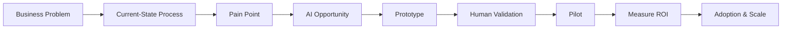
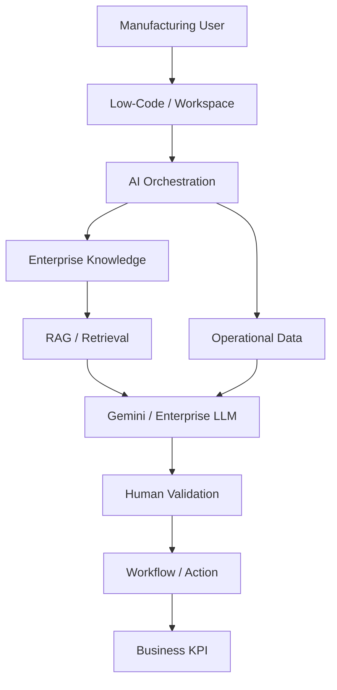

# Manufacturing AI Transformation Portfolio

> **Manufacturing Engineering + Quality + Generative AI + Low-Code Automation**

A practical portfolio demonstrating how manufacturing and quality problems can be translated into AI-enabled solutions with measurable business value.


---

## Portfolio

| Project | Business problem | AI solution | Business value |
|---|---|---|---|
| **01 — AI Quality & 8D Assistant** | Unstructured quality complaints require manual analysis | Structured AI-assisted 8D/RCA drafting | Engineering productivity |
| **02 — Manufacturing RAG Copilot** | Engineering knowledge is distributed across documents | Retrieval-Augmented Generation | Faster troubleshooting |
| **03 — Low-Code Manufacturing AI Agent** | Issue triage requires repetitive manual steps | AI classification + workflow | Faster, standardized triage |

---

## My AI transformation approach



### Enterprise AI architecture



---

# 01 — AI Quality & 8D Assistant

### Business problem

Quality engineers often spend significant time converting field, warranty, production, or service complaints into structured problem-solving artifacts.

### AI solution

```text
Complaint
   ↓
Structured extraction
   ↓
Problem statement
   ↓
5-Why hypotheses
   ↓
Containment
   ↓
Corrective-action candidates
   ↓
Validation plan
   ↓
Human engineering approval
```

### Example

**Input**

> Vehicle intermittently loses communication with the engine controller after an extended key-off period.

**Draft output**

- D2 — problem definition
- D3 — containment
- D4 — root-cause hypotheses
- D5 — corrective-action candidates
- D6 — validation
- D7 — prevention
- D8 — closure criteria

### Technology

`Python` `pandas` `8D` `5-Why` `RCA` `Human-in-the-loop`

[Open Project 01 →](./01-ai-quality-8d-assistant/)

---

# 02 — Manufacturing RAG Copilot

### Business problem

Engineering knowledge is frequently distributed across troubleshooting guides, quality reports, service procedures, PFMEA documents and lessons learned.

The challenge is often **finding the right information quickly**.

### AI solution

```text
Engineer question
       ↓
Retrieval
       ↓
Relevant evidence
       ↓
Gemini / enterprise LLM
       ↓
Grounded answer
       ↓
Source references
```

### Example question

> What should I check for an intermittent communication fault?

The assistant retrieves relevant guidance covering:

- power and grounds
- connectors
- harness integrity
- network integrity
- temperature/vibration effects
- event capture
- failure reproduction

### Technology

`Python` `scikit-learn` `TF-IDF` `RAG` `Knowledge Base`

[Open Project 02 →](./02-manufacturing-rag-copilot/)

---

# 03 — Low-Code Manufacturing AI Agent

### Business problem

Manufacturing issue triage often requires users to manually:

1. Read the issue
2. Categorize it
3. Find guidance
4. Identify likely causes
5. Recommend diagnostic checks
6. Document and route the action

### AI solution

```text
Issue submitted
       ↓
AI classification
       ↓
Knowledge lookup
       ↓
Likely causes
       ↓
Recommended checks
       ↓
Human approval
       ↓
Workflow / ticket
       ↓
Dashboard
```

### Low-code mapping

| Capability | Google | Microsoft |
|---|---|---|
| User interface | AppSheet | Power Apps |
| Workflow | Workspace Studio | Power Automate |
| AI | Gemini | Approved enterprise AI |
| Data | Sheets / approved sources | Dataverse / SharePoint |
| Reporting | Looker | Power BI |

[Open Project 03 →](./03-low-code-manufacturing-ai-agent/)

---

# Business value & ROI

AI transformation should be measured by **business outcomes**, not prompt volume.

### Illustrative productivity case

- 20 engineers
- 2 hours/week preparing initial quality summaries
- $60/hour loaded engineering cost
- 40% time reduction

```text
20 × 2 × $60 × 40%
= $960/week

≈ $49,920/year
```

This is an illustrative business-case model, not a claimed production saving.

### KPIs

| Category | KPI |
|---|---|
| Productivity | Hours saved/week |
| Quality | Rework / first-pass quality |
| Speed | Cycle time |
| Adoption | Active users |
| Accuracy | AI validation rate |
| Engagement | Repeat usage |
| Business | Annualized value |
| Experience | User satisfaction |

See [ROI Framework](./docs/ROI_FRAMEWORK.md).

---

# AI governance

The portfolio follows:

- Human-in-the-loop for engineering and quality decisions
- Approved enterprise AI platforms for proprietary data
- Data classification and access control
- Grounded answers where possible
- AI evaluation and monitoring
- Auditability
- Escalation and rollback

> **AI accelerates the expert; it does not remove accountability from the expert.**

See [AI Governance](./docs/AI_GOVERNANCE.md).

---

# Technology stack

### AI
Generative AI · LLMs · RAG · AI agents · prompting · evaluation

### Enterprise AI
Google Gemini · Workspace AI · AppSheet · Workspace Studio · Power Apps · Power Automate

### Data
Python · pandas · scikit-learn · SQL concepts · Excel

### Manufacturing
8D · 5-Why · Ishikawa · PFMEA · RCA · Continuous Improvement · Process Mapping

---

# Lessons learned

### 1. Start with the business problem
AI is not the objective. The objective is better quality, productivity, speed, knowledge access, or decision-making.

### 2. RAG matters for company-specific knowledge
General model knowledge is not a replacement for controlled engineering documentation.

### 3. Human validation is essential
AI-generated hypotheses are not confirmed root causes.

### 4. Low-code accelerates experimentation
A low-code workflow can move an idea to pilot quickly.

### 5. Adoption determines value
A technically impressive solution that users do not trust or use has little business impact.

---

# Roadmap

- [x] AI Quality / 8D prototype
- [x] Local RAG prototype
- [x] Low-code AI agent concept
- [x] ROI framework
- [x] Governance framework
- [ ] Gemini API integration
- [ ] PDF/document ingestion
- [ ] Embedding-based retrieval
- [ ] Interactive web UI
- [ ] AI evaluation dataset
- [ ] Adoption dashboard
- [ ] Enterprise AppSheet / Power Apps implementation

---

## Screenshots

Add real screenshots after running each project. Recommended:

- application input
- AI output
- evidence/source references
- workflow or human-validation step

Suggested locations:

`01-ai-quality-8d-assistant/screenshots/`

`02-manufacturing-rag-copilot/screenshots/`

`03-low-code-manufacturing-ai-agent/screenshots/`

> All portfolio data is synthetic/sample data. No proprietary employer information is included.
