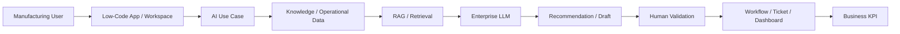

# Reference Architecture

```mermaid
flowchart LR
    A[Manufacturing User] --> B[Low-Code App / Workspace]
    B --> C[AI Use Case]
    C --> D[Knowledge / Operational Data]
    D --> E[RAG / Retrieval]
    E --> F[Enterprise LLM]
    F --> G[Recommendation / Draft]
    G --> H[Human Validation]
    H --> I[Workflow / Ticket / Dashboard]
    I --> J[Business KPI]
```

This is the target architecture concept for the portfolio. The repository's local Python implementations intentionally avoid requiring proprietary APIs.
